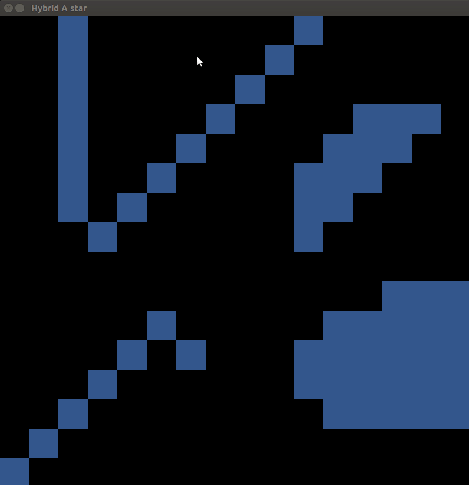

# Hybrid A* search



This repo implements the simple hybrid a* for search the optimal path from start position to goal position. It uses kinematic model for model constraint. Also, it visualizes the path and the map via OpenCV.

For more information, please visit this [blog post](https://kyuhwanyeon.github.io/planning/hybrid-astar/)


## Features

*  [kinematic model](https://kyuhwanyeon.github.io/planning/mpcformulation/) for the state transition equation

```    c++
    // kinematic model
    double delta = DEG2RADIAN * delta_i;
    double omega = SPEED / VEHICLE_LEGTH * (delta) * DT;
    double next_theta = theta + omega;
    if(next_theta < 0) {
      next_theta += 2*M_PI;
    }
    double next_x = x + SPEED * cos(theta)* DT;
    double next_y = y + SPEED * sin(theta)* DT;
```

* Sampling interval of the steering angle:  5° 
* Heuristic function
  * Euclidean distance + Angle error

```  c++
  double euclidian_distance = sqrt(pow((x1-x2),2)+pow((y1-y2),2));
  double angle_err = abs(theta1 - theta2);
```

* Visualization with OpenCV


## Dependencies

* OpenCV >= 2.4.9.1

 * CMake >= 3.5.1

* CMAKE_CXX_STANDARD >=11


## Build

```shell
mkdir build && cd build
cmake ..
make
./HYBRID_A_STAR
```

